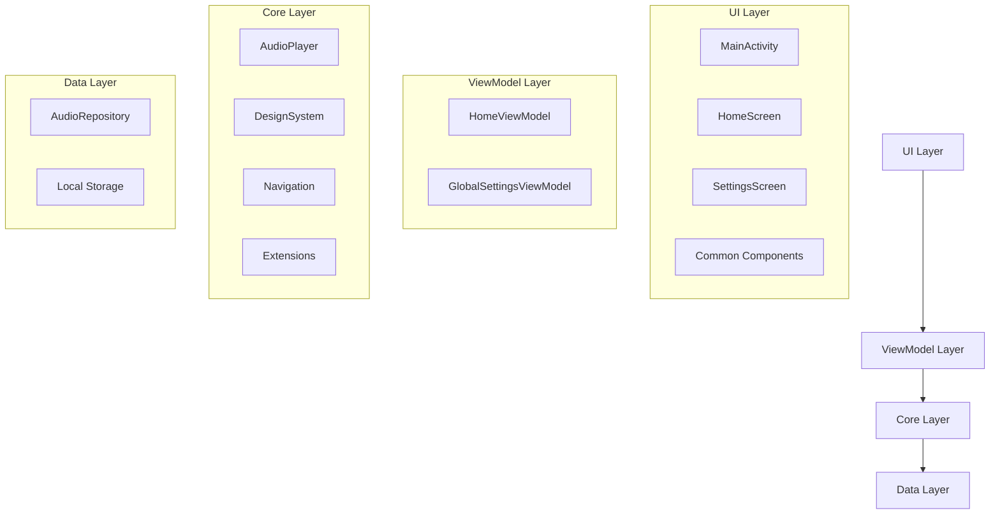

# システムアーキテクチャ

## コンポーネント構成図

## モジュール階層構造
- `screens/`: UIレイヤー
  - 画面コンポーネント
  - アクティビティ
- `viewmodels/`: ビジネスロジックレイヤー
  - ViewModelクラス
  - 状態管理
- `core/`: コア機能レイヤー
  - オーディオプレーヤー
  - バックグラウンドサービス
- `data/`: データレイヤー
  - リポジトリ
  - ローカルストレージ

## データフロー
1. ユーザーインタラクション
   - 画面からの操作イベント
2. ViewModel処理
   - 状態更新
   - ビジネスロジック実行
3. コア機能呼び出し
   - オーディオ再生制御
   - バックグラウンド処理
4. データアクセス
   - ローカルストレージ操作
5. UI更新
   - 状態変更通知
   - 画面表示更新

## 重要な設計決定
- アーキテクチャ選択理由
  - MVVMパターンを採用し、UIとビジネスロジックの分離を実現
  - クリーンアーキテクチャの原則に基づき、レイヤー分離を実施
  - テスト容易性と保守性の向上を考慮

- トレードオフと理由
  - シンプルな構造を維持するため、過度な抽象化を避けている
  - パフォーマンスとコードの複雑さのバランスを考慮
  - 拡張性を確保しつつ、初期開発の効率性も重視

- スケーラビリティ考慮点
  - モジュール化された構造により、機能追加が容易
  - 依存性注入の仕組みを準備
  - 将来的な機能拡張を見据えたインターフェース設計
