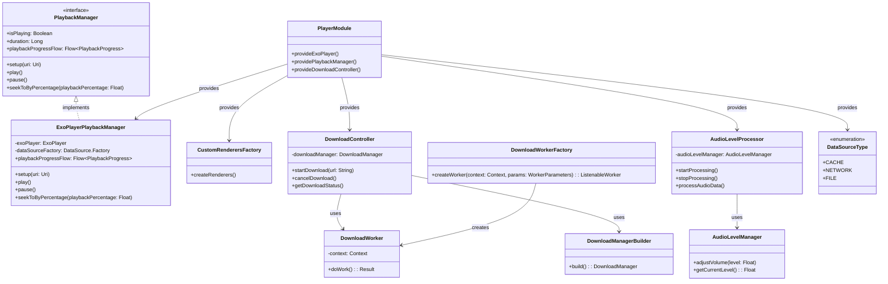

# AudioPlayer モジュール

## 概要
AudioPlayerモジュールは、アプリケーションのオーディオ再生機能を提供するコアコンポーネントです。
ExoPlayerをベースに構築され、オーディオ再生、ダウンロード、音声処理などの機能を提供します。

## クラス図


## ディレクトリ構造
```
core/player/
├── di/                    # 依存性注入関連
├── download/              # ダウンロード機能
├── processor/             # 音声処理関連
└── *.kt                   # コアインターフェースと実装
```

## 主要コンポーネント

### 1. 再生管理
- `PlaybackManager.kt`
  - オーディオ再生の基本インターフェースを定義
  - 再生状態、進捗、制御メソッドを提供
  - 主な機能：
    - 再生/一時停止
    - シーク操作
    - 再生進捗の監視
    - 再生時間の取得

- `ExoPlayerPlaybackManager.kt`
  - `PlaybackManager`のExoPlayerベースの実装
  - ExoPlayerの機能をラップして提供
  - 特徴：
    - コルーチンベースの進捗監視
    - メディアソースの動的設定
    - シングルトンスコープでの管理
    - キャッシュ対応のDataSourceFactoryの使用

- `CustomRenderersFactory.kt`
  - ExoPlayerのレンダラーをカスタマイズ
  - オーディオ再生の最適化
  - 特殊なオーディオ形式のサポート

### 2. ダウンロード管理
- `DownloadController.kt`
  - オーディオファイルのダウンロード制御
  - ダウンロード状態の管理
  - キャッシュ制御

- `DownloadWorker.kt`
  - WorkManagerを使用したバックグラウンドダウンロード
  - ダウンロード進捗の監視
  - エラーハンドリング

- `DownloadManagerBuilder.kt`
  - ダウンロードマネージャーの構築
  - 設定のカスタマイズ
  - 依存関係の注入

### 3. 音声処理
- `AudioLevelProcessor.kt`
  - オーディオレベルの処理と分析
  - リアルタイム音声処理
  - 音声データの変換と分析

- `AudioLevelManager.kt`
  - オーディオレベルの管理
  - 音量制御
  - 音声品質の調整

### 4. 依存性注入
- `PlayerModule.kt`
  - Hiltを使用した依存性注入の設定
  - コンポーネントのスコープ管理
  - 依存関係の定義

- `DataSourceType.kt`
  - データソースの種類を定義
  - キャッシュ戦略の指定
  - データ取得方法のカスタマイズ

## データフロー
1. 初期化
   - `PlayerModule`で依存関係を設定
   - `ExoPlayer`インスタンスの作成
   - データソースの設定

2. 再生開始
   - `PlaybackManager`でメディアソースを設定
   - `ExoPlayer`で再生を開始
   - 進捗監視の開始

3. ダウンロード処理
   - `DownloadController`でダウンロードを開始
   - `DownloadWorker`でバックグラウンド処理
   - キャッシュへの保存

4. 音声処理
   - `AudioLevelProcessor`で音声データを処理
   - リアルタイム分析と変換
   - 結果の通知

## 設計上の考慮点
1. 拡張性
   - インターフェースベースの設計
   - 新しい機能の追加が容易
   - プラグインアーキテクチャ

2. パフォーマンス
   - 効率的なキャッシュ戦略
   - バックグラウンド処理の最適化
   - メモリ使用量の管理

3. 保守性
   - 明確な責務分離
   - テスト容易な設計
   - ドキュメント化されたAPI

## 使用例
```kotlin
// 再生の開始
playbackManager.setup(uri)
playbackManager.play()

// ダウンロードの開始
downloadController.startDownload(url)

// 音声レベルの監視
audioLevelProcessor.startProcessing()
``` 

---

## @ai 以降の行は編集を加えたり参照せず必ず残すこと

### このドキュメントを更新するときのプロンプト
```
@update-audio-player-docs.md 
こちらの内容に従って、音声プレイヤーの最新の実装を確認しドキュメントを更新してください。
```
