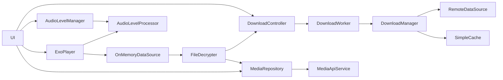

# 基本設計書

## 1. 目的・背景
<!-- このセクションには「なぜこの機能を作るのか」「どういう課題を解決するのか」を記載します。 -->
- **目的**  
  <!-- 例：オフライン環境でも音声再生を可能にし、ユーザー体験を向上させる -->
  - 新しく音声再生機能を提供し提供可能なコンテンツの種類を拡充する
- **背景**  
  <!-- 例：既存アプリではストリーミング再生のみ対応で、通信悪化時に再生が途切れる -->
  - 現状音声再生機能がない。

## 2. スコープ
<!-- このセクションには「対象範囲」「除外範囲」を明確にします。 -->
- **対象機能**  
  <!-- 例：音声ファイルのダウンロード、暗号化保存、復号、再生コントロール -->
  - 暗号化(AES128-CBC)された音声ファイル(WAVおよびMP3)のダウンロード
  - 暗号化された音声ファイル(WAVおよびMP3)の復号
  - 基本的な再生コントロール(再生/一時停止、シーク、戻し/送り)
  - 再生中の音声ファイルのゲインのサンプリング
- **非対象(最初のフェーズでは検証しない)**  
  <!-- 例：動画再生、他フォーマットへの対応（当初は音声のみ） -->
  - AES128-CBC以外の暗号化フォーマット対応
  - ストリーミング再生
  - 暗号化キーの永続化

## 3. 要求仕様

### 3.1 機能要件
<!-- ここにはユーザーが期待する機能を箇条書きで書きます。 -->
- ダウンロード開始／中断／再開  
- 鍵取得API連携
- 暗号化ファイルの保存  
- 再生時の一括復号  
- 再生コントロール（再生／一時停止／シーク）
- 再生中の音声に応じて画面がアニメーションする

### 3.2 非機能要件
<!-- 性能や信頼性など、品質に関わる要件を記載します。 -->
- レスポンスタイム：再生開始はダウンロード完了後10秒以内  
- セキュリティ：復号結果はオンメモリで保持しアプリのライフサイクルに応じて明示的に削除する
- リトライ：ネットワークエラー時に指数バックオフで3回再試行
- 保守性：DI (Hilt) でモジュール分割

## 4. アーキテクチャ概要
<!-- システム全体の構成やモジュール間の関係を高レベルで示す図／説明を入れます。 -->

<!-- 図の下に「各コンポーネントの役割」を簡単に補足すると親切です。 -->

### 4.1 各種コンポーネントの概要

layer:Data

- RemoteDataSource : http通信でサーバーとデータをやり取りするクラス
- MediaApiService : サーバーからメディアに関連する情報を取得するRetrofitインスタンス
- MediaRepository : MediaApiServiceを用いてメディアに関連する情報を取得する(メディアアイテムの参照や復号キーの取得)
- SimpleCache : ファイルの置き場を提供する

layer:Download

- DownloadManager : メディアファイルのダウンロードを管理する
- DownloadWorker : DownloadManagerを動作させるためのワーカーインスタンス
- DownloadController : DownloadWorkerを起動、停止したり、進捗状況を取得し共有する

layer:Playback

- FileDecrypter : キーを取得しDownloadController経由で暗号化されたファイルを参照し復号する。
  ByteArrayで復号結果を出力する
- OnMemoryDataSource : ByteArrayを読み込みExoPlayerが再生できる形に変換する。ライフサイクルと連動してメモリ上のデータを削除する
- ExoPlayer : 一般的なExoPlayerインスタンス。DataSourceと連携して音声再生を行う。再生一時停止やシークなどのハンドリングも行う
- AudioLevelProcessor : 再生中の生の音声データをサンプリングしゲインを算出する。
- AudioLevelManager : AudioLevelProcessorのリスナに応じて現在のゲイン値を取得、Flowで流す

layer:UI

- UI : 基本的なUI、音声再生のコントロールや再生可能な音声ファイルの一覧をユーザーに提供

## 5. 外部インターフェース
<!-- API仕様やストレージ設計など、他システムとのやり取りを定義します。 -->
| 種別             | エンドポイント／場所                                     | 説明                                             |
| ---------------- | -------------------------------------------------------- | ------------------------------------------------ |
| ダウンロードAPI  | `GET api/files`                                          | メディアファイルの一覧を取得                     |
| ダウンロードAPI  | `GET api/media/{mediaId}`                                | メディアファイルの暗号化データを取得             |
| ダウンロードAPI  | `GET api/media/{mediaId}/license`                        | メディアファイルの複合キーを取得                 |
| 保存ディレクトリ | `/data/user/0/io.github.datt16.audioplayer/cache/caches` | ダウンロードした暗号化された音声ファイルの格納先 |
