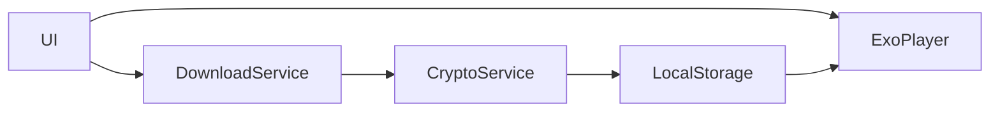

# 基本設計書

## 1. 目的・背景
<!-- このセクションには「なぜこの機能を作るのか」「どういう課題を解決するのか」を記載します。 -->
- **目的**  
  <!-- 例：オフライン環境でも音声再生を可能にし、ユーザー体験を向上させる -->
- **背景**  
  <!-- 例：既存アプリではストリーミング再生のみ対応で、通信悪化時に再生が途切れる -->

## 2. スコープ
<!-- このセクションには「対象範囲」「除外範囲」を明確にします。 -->
- **対象機能**  
  <!-- 例：音声ファイルのダウンロード、暗号化保存、復号、再生コントロール -->
- **非対象**  
  <!-- 例：動画再生、他フォーマットへの対応（当初は音声のみ） -->

## 3. 要求仕様

### 3.1 機能要件
<!-- ここにはユーザーが期待する機能を箇条書きで書きます。 -->
- ダウンロード開始／中断／再開  
- 鍵取得API連携  
- 暗号化ファイルの保存  
- 再生時のオンザフライ復号 or 一括復号  
- 再生コントロール（再生／一時停止／シーク）

### 3.2 非機能要件
<!-- 性能や信頼性など、品質に関わる要件を記載します。 -->
- レスポンスタイム：再生開始はダウンロード完了後○秒以内  
- セキュリティ：Android Keystore 使用  
- リトライ：ネットワークエラー時に指数バックオフで3回再試行  
- 保守性：DI (Hilt) でモジュール分割

## 4. アーキテクチャ概要
<!-- システム全体の構成やモジュール間の関係を高レベルで示す図／説明を入れます。 -->

<!-- 図の下に「各コンポーネントの役割」を簡単に補足すると親切です。 -->

## 5. 外部インターフェース
<!-- API仕様やストレージ設計など、他システムとのやり取りを定義します。 -->
| 種別            | エンドポイント／場所                              | 説明                                     |
| --------------- | ----------------------------------------------- | ---------------------------------------- |
| ダウンロードAPI  | `GET /audio/{id}`                                | 認証トークン付きで音声ファイルを取得      |
| 鍵取得API        | `POST /key`                                      | body: `{ contentId }` → `{ key, iv }`     |
| 保存ディレクトリ  | `/data/user/0/<app>/files/audio/`                | ダウンロードしたファイルの格納先           |
