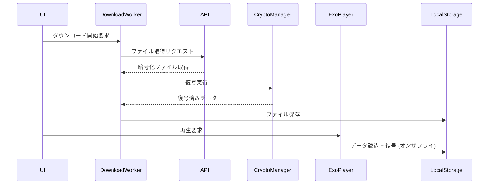

# 詳細設計書

## 1. クラス・パッケージ設計
<!-- 各クラスの責務、パッケージ構成、公開メソッドを定義します。 -->
```none
com.example.audio
├── DownloadWorker.kt        # ダウンロード実行
├── DownloadManagerWrapper.kt # WorkManager とのラップ
├── CryptoManager.kt         # AES 復号ロジック
├── AesCipherDataSource.kt   # ExoPlayer 用 DataSource 実装
└── PlayerController.kt      # 再生制御ロジック
```
<!-- 各クラスの上に「何のためのクラスか」を一行コメントで入れると良い -->

## 2. DI 設計（Hilt モジュール）

```kotlin
@Module
@InstallIn(SingletonComponent::class)
object AudioModule {
  @Provides @Singleton
  fun provideCryptoManager(@ApplicationContext ctx: Context): CryptoManager { ... }

  @Provides @Singleton
  fun provideDataSourceFactory(
    cryptoManager: CryptoManager
  ): DataSource.Factory { ... }
}
```
<!-- どの依存をどう注入するか、対応表形式でも Ok -->

## 3. シーケンス図
<!-- 代表的なユースケースのステップを詳細に示します。 -->

<!-- エラー分岐やリトライも同様に別図で示すと理解しやすい -->

## 4. 永続化スキーマ
<!-- Room Entity／DAO を具体的に定義します。 -->
```kotlin
@Entity(tableName = "downloads")
data class DownloadEntity(
  @PrimaryKey val contentId: String,
  val url: String,
  val filePath: String,
  val status: DownloadStatus,
  val updatedAt: Long
)
```

```kotlin
@Dao
interface DownloadDao {
  @Query("SELECT * FROM downloads WHERE contentId = :id")
  fun findById(id: String): DownloadEntity?
  @Insert(onConflict = REPLACE) fun upsert(entity: DownloadEntity)
}
```

## 5. 暗号化／復号アルゴリズム詳細

- **AES モード**：AES-CTR（セグメント単位でオンザフライ復号可能）  
- **Key/IV 管理**：初期化時に Keystore から取得し、メモリ上で保持  
- **チャンク処理**：4096 バイト単位で復号

## 6. ネットワーク設計

- **WorkManager**：Constraints（Wi-Fi 接続時のみ）  
- **リトライポリシー**：Fibonacci Backoff、最大 5 回  
- **同時ダウンロード数**：3 スレッド

## 7. 再生パラメータ設定

| 設定項目                          | 値                        | 説明                                    |
| --------------------------------- | ------------------------- | --------------------------------------- |
| bufferForPlaybackMs               | 1500                      | 再生開始までの最小バッファ（ms）        |
| bufferForPlaybackAfterRebufferMs | 2000                      | リバッファ後再生再開のバッファ閾値      |

## 8. エラーハンドリング

- **API 失敗**：UI にトースト表示＋リトライボタン  
- **復号失敗**：キャッシュ破棄＋再ダウンロード  
- **IO エラー**：ログ出力（WARN）、アラートダイアログ

## 9. テスト計画

- **単体テスト**：CryptoManager の復号ロジック  
- **統合テスト**：実際ファイルをダウンロード→復号→再生  
- **UI テスト**：エラー時ダイアログ表示、オフライン起動

## 10. ロギング／監視

- **ログタグ**：`AudioDownload`, `AudioCrypto`, `AudioPlayer`  
- **メトリクス**：ダウンロード時間、復号時間、エラー率（Crashlytics 連携）
